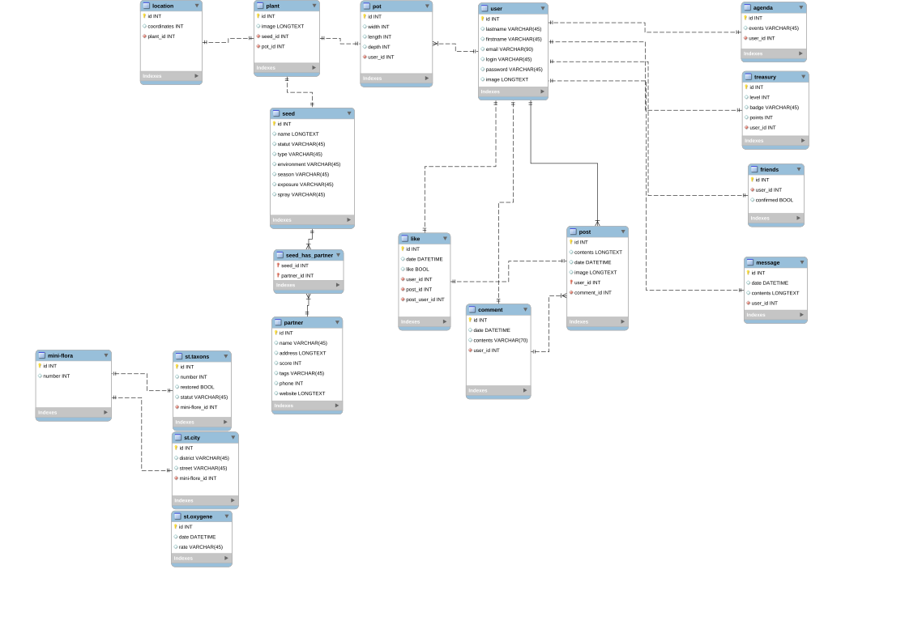

# biarritz_P3_floco_backend

## Wireframe



## Packages

- @hapi/joi
- bcrypt
- cors
- dotenv
- express
- jsonwebtoken
- mysql2
- passport
- passport-facebook
- passport-google
- sequelize
- uuid
- pg
- pg-hstore
- chai
- husky
- mocha
- morgan
- nodemon
- prettier
- pretty-quick

## Getting started

These command need to be executed in the terminal:

### Fork the project

```
git clone https://github.com/WildCodeSchool/biarritz_P3_floco_backend.git
```

### Install package

```
npm install
```
**Before launching the server** you should first create a `.env`  file, follow the instruction in `example.env`.

## Available Scripts

These command need to be executed in the terminal:

### Launch the test

```
npm test
```
The test will appear in the terminal.

### Launch the server on port 8000

```
npm start
```
### Launch the server on port 8000 in dev environment

```
npm run dev
```
Open [http://localhost:8000](http://localhost:8000) to view it in the browser.
### Drop the database and recreate it

```
npm run resync
```
this command need to be execute everytime you change the database.

## File organization

### `Middlewares`
It add modification to the request send in `route.js` files.
It contain 2 middlewares: 
 1. requiring the token
 2. precise the params of the object request
 
- `joiSchemas.js` manage all the schemas who validate the object request send to the route. There is schema for the POST and PUT routes. `.required()`mean that the response will be an error if the value is not provide.
- `joiValidate.js` is the middleware who manage the validation of the schemas
- `tokenJwt.js`is the middleware who require a token to access the routes. It is called `checkAuth`.

### `Routes`
It contain all the express routes files.
- `agenda.routes.js` has 5 routes, **these routes are never use**:
	 - GET ALL: get all the agendas, need a token to access the route. 
	 - GET ONE: get one agenda, need a token to access the route and the id of the agenda. 
	 - PUT: modify one agenda, need a token to access the route and the id of the agenda, you can only update the params who are in the `joiSchema.js`. 
	 - POST: create one agenda, need a token to access the route, you can only create the params who are in the `joiSchema.js`. 
	 - DELETE: delete one agenda, need a token to access the route and the id of the agenda.
- `comments.routes.js` has 5 routes, **these routes are  never use**:
	 - GET ALL: get all the comments, need a token to access the route. 
	 - GET ONE: get one comment, need a token to access the route and the id of the comment. 
	 - PUT: modify one comment, need a token to access the route and the id of the comment, you can only update the params who are in the `joiSchema.js`. 
	 - POST: create one comment, need a token to access the route, you can only create the params who are in the `joiSchema.js`. 
	 - DELETE: delete one comment, need a token to access the route and the id of the comment.
- `friends.routes.js`has 5 routes, **these routes are never use**:
	 - GET ALL: get all the friends, need a token to access the route. 
	 - GET ONE: get one friend, need a token to access the route and the id of the friend. 
	 - PUT: modify one friend, need a token to access the route and the id of the friend, you can only update the params who are in the `joiSchema.js`. 
	 - POST: create one friend, need a token to access the route, you can only create the params who are in the `joiSchema.js`. 
	 - DELETE: delete one friend, need a token to access the route and the id of the friend.
- `likes.routes.js`has 5 routes, **these routes are never use**:
	 - GET ALL: get all the likes, need a token to access the route. 
	 - GET ONE: get one like, need a token to access the route and the id of the like. 
	 - PUT: modify one like, need a token to access the route and the id of the like, you can only update the params who are in the `joiSchema.js`. 
	 - POST: create one like, need a token to access the route, you can only create the params who are in the `joiSchema.js`. 
	 - DELETE: delete one like, need a token to access the route and the id of the like.
- `locations.routes.js`has 5 routes:
	 - GET ALL: get all the locations.
	 - GET ONE: get one location, need the id of the location. 
	 - PUT: modify one location, need a token to access the route and the id of the location, you can only update the params who are in the `joiSchema.js`. 
	 - POST: create one location, need a token to access the route, you can only create the params who are in the `joiSchema.js`. 
	 - DELETE: delete one location, need a token to access the route and the id of the location.
- `login.routes.js` this file purpose is to **authenticate the user** with a form or with the passport of Facebook and Google, it has 5 routes:
	 - POST: find if the user exist and if the password is valid, sign a token if there is no error.
	 - GET: it ask you to login with your Facebook account.
	 - GET: if your login with Facebook, a token is sign and you are redirect to the frontend.
	 - GET: it ask you to login with your Google account.
	 - GET: if your login with Google, a token is sign and you are redirect to the frontend.
- `messages.routes.js`has 5 routes, **these routes are never use**:
	 - GET ALL: get all the messages, need a token to access the route. 
	 - GET ONE: get one message, need a token to access the route and the id of the message. 
	 - PUT: modify one message, need a token to access the route and the id of the message, you can only update the params who are in the `joiSchema.js`. 
	 - POST: create one message, need a token to access the route, you can only create the params who are in the `joiSchema.js`. 
	 - DELETE: delete one message, need a token to access the route and the id of the message.
- `miniFlora.routes.js`has 5 routes:
	 - GET ALL: get all the miniFloras. 
	 - GET ONE: get one miniFlora, need the id of the miniFlora. 
	 - PUT: modify one miniFlora, need the id of the miniFlora, you can only update the params who are in the `joiSchema.js`. 
	 - POST: create one miniFlora, you can only create the params who are in the `joiSchema.js`. 
	 - DELETE: delete one miniFlora, need the id of the miniFlora.
- `partners.routes.js`has 5 routes,**these routes are never use**:
	 - GET ALL: get all the partners. 
	 - GET ONE: get one partner, need the id of the partner. 
	 - PUT: modify one partner, need the id of the partner, you can only update the params who are in the `joiSchema.js`. 
	 - POST: create one partner, you can only create the params who are in the `joiSchema.js`. 
	 - DELETE: delete one partner, need the id of the partner.
- `plants.routes.js`has 5 routes:
	 - GET ALL: get all the plants. 
	 - GET ONE: get one plant, need the id of the plant. 
	 - PUT: modify one plant, need a token to access the route and the id of the plant, you can only update the params who are in the `joiSchema.js`. 
	 - POST: create one plant, need a token to access the route, you can only create the params who are in the `joiSchema.js`. 
	 - DELETE: delete one plant, need a token to access the route and the id of the plant.
- `posts.routes.js`has 5 routes, **these routes are never use**:
	 - GET ALL: get all the posts, need a token to access the route. 
	 - GET ONE: get one post, need a token to access the route and the id of the post. 
	 - PUT: modify one post, need a token to access the route and the id of the post, you can only update the params who are in the `joiSchema.js`. 
	 - POST: create one post, need a token to access the route, you can only create the params who are in the `joiSchema.js`. 
	 - DELETE: delete one post, need a token to access the route and the id of the post.
- `pots.routes.js`has 5 routes:
	 - GET ALL: get all the pots, need a token to access the route. 
	 - GET ONE: get one pot, need a token to access the route and the id of the pot. 
	 - PUT: modify one pot, need a token to access the route and the id of the pot, you can only update the params who are in the `joiSchema.js`. 
	 - POST: create one pot, need a token to access the route, you can only create the params who are in the `joiSchema.js`. 
	 - DELETE: delete one pot, need a token to access the route and the id of the pot.
- `seeds.routes.js`has 5 routes:
	 - GET ALL: get all the seeds.
	 - GET ONE: get one seed, need the id of the seed. 
	 - PUT: modify one seed, need a token to access the route and the id of the seed, you can only update the params who are in the `joiSchema.js`. 
	 - POST: create one seed, need a token to access the route, you can only create the params who are in the `joiSchema.js`. 
	 - DELETE: delete one seed, need a token to access the route and the id of the seed.
- `stasCity.routes.js`has 5 routes:
	 - GET ALL: get all the stasCitys.
	 - GET ONE: get one stasCity, need the id of the stasCity. 
	 - PUT: modify one stasCity, need the id of the stasCity, you can only update the params who are in the `joiSchema.js`. 
	 - POST: create one stasCity, you can only create the params who are in the `joiSchema.js`. 
	 - DELETE: delete one stasCity, need the id of the stasCity.
- `statsOxygene.routes.js`has 5 routes, **these routes are never use**:
	 - GET ALL: get all the statsOxygenes.
	 - GET ONE: get one statsOxygene, need the id of the statsOxygene. 
	 - PUT: modify one statsOxygene, need the id of the statsOxygene, you can only update the params who are in the `joiSchema.js`. 
	 - POST: create one statsOxygene, you can only create the params who are in the `joiSchema.js`. 
	 - DELETE: delete one statsOxygene, need the id of the statsOxygene.
- `statsTaxons.routes.js`has 5 routes, **these routes are never use**:
	 - GET ALL: get all the statsTaxons.
	 - GET ONE: get one statsTaxons, need the id of the statsTaxons. 
	 - PUT: modify one statsTaxons, need the id of the statsTaxons, you can only update the params who are in the `joiSchema.js`. 
	 - POST: create one statsTaxons, you can only create the params who are in the `joiSchema.js`. 
	 - DELETE: delete one statsTaxons, need the id of the statsTaxons.
- `tresaury.routes.js`has 5 routes:
	 - GET ALL: get all the tresaury, need a token to access the route. 
	 - GET ONE: get one tresaury, need a token to access the route and the id of the tresaury. 
	 - PUT: modify one tresaury, need a token to access the route and the id of the tresaury, you can only update the params who are in the `joiSchema.js`. 
	 - POST: create one tresaury, need a token to access the route, you can only create the params who are in the `joiSchema.js`. 
	 - DELETE: delete one tresaury, need a token to access the route and the id of the tresaury.
- `users.routes.js`has 7 routes:
	 - GET ALL: get all the users.
	 - GET ALL LOCATIONS: get all the locations of the plants who belong to the user id, need the id of the user. 
	 - GET ONE: get one user, need the id of the user. 
	 - GET ONE TRESAURY: get the tresaury who belong to the user id, need the id of the user. 
	 - PUT: modify one user, need a token to access the route and the id of the user, you can only update the params who are in the `joiSchema.js`. 
	 - POST: create one user, you can only create the params who are in the `joiSchema.js`. 
	 - DELETE: delete one user, need a token to access the route and the id of the user.

### `Sequelize`
The project use [Sequelize](https://sequelize.org/v5/) to avoid writing all the information by hand in MySQL database, it manage to save time.

 - `associations.js`
 - `config.js`
 - `index.js`
 - `resync.js`

#### - `Models`
- `agenda.js`
- `comments.js`
- `friends.js`
- `likes.js`
- `locations.js`
- `messages.js`
- `miniFlora.js`
- `partners.js`
- `plants.js`
- `posts.js`
- `pots.js`
- `seeds.js`
- `stasCity.js`
- `statsOxygene.js`
- `statsTaxons.js`
- `tresaury.js`
- `users.js`

### `Test`
- `agenda.test.js`
- `comments.test.js`
- `friends.test.js`
- `likes.test.js`
- `locations.test.js`
- `messages.test.js`
- `miniFlora.test.js`
- `partners.test.js`
- `plants.test.js`
- `posts.test.js`
- `pots.test.js`
- `seeds.test.js`
- `stasCity.test.js`
- `statsOxygene.test.js`
- `statsTaxons.test.js`
- `tresaury.test.js`
- `users.test.js`

## The team

Student from the Wild Code School

- [Dominic Brice](https://github.com/dominicBrice)
- [Lucas Leproux](https://github.com/lucas240)
- [Jules Bonard](https://github.com/julesbonard)
- [Frédérique Mendy](https://github.com/Superdref)

#### Project bearer: "Ying Wang"
